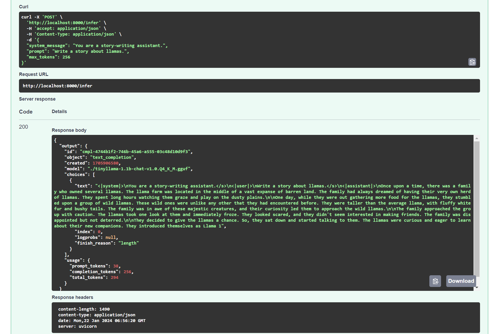
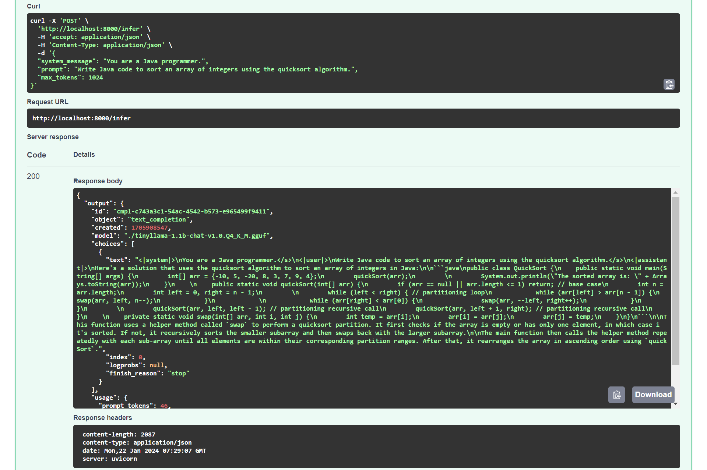

## About this project
This is a basic python application which provides an endpoint to query a pre-trained LLM given a system message and user prompt. FastAPI and Uvicorn are used for the web framework and web server implementation respectively.

The LLM chosen is [TheBloke/TinyLlama-1.1B-Chat-v1.0-GGUF](https://huggingface.co/TheBloke/TinyLlama-1.1B-Chat-v1.0-GGUF) from Hugging Face, which is a quantized model in GGUF format based on [TinyLlama/TinyLlama-1.1B-Chat-v1.0](https://huggingface.co/TinyLlama/TinyLlama-1.1B-Chat-v1.0).

## Setting up
First, run `make model` to download the model file from Hugging Face to the current working directory.

To start the application locally for development, first run `pip install -r requirements.txt` to install the required packages and then `make dev` to start the server.

To start the application in a Docker container, first run `make build` to build the Docker image and then `make run` to start the container.

## Querying the model
To query the model, send a POST request to `http://localhost:8000/infer` with the following JSON body:
```
{
  "system_message": <System message>,
  "prompt": <User prompt>,
  "max_tokens": <Maximum number of generated tokens>
}
```
For example,
```
{
  "system_message": "You are a story-writing assistant.",
  "prompt": "Write a story about llamas.",
  "max_tokens": 256
}
```
For convenience, HTTP requests can be sent via the built-in Swagger UI at `http://localhost:8000/docs`.


